# Pit Lane Live Board — guida

*[English](guide.md)*

La Formula 1 nella barra laterale di Home Assistant: la classifica live con i tempi, il
calendario, ogni gara dal 1950 e i due campionati. Questa guida copre tutto, in ordine:
leggi le prime due sezioni e sei a posto; torna sulle altre quando ti servono.

- [Installazione](#installazione)
- [Impostazioni e tempi live](#impostazioni-e-tempi-live)
- [Le quattro pagine](#le-quattro-pagine)
- [Leggere la classifica live](#leggere-la-classifica-live)
- [Bandiere e commissari](#bandiere-e-commissari)
- [Ritardo TV](#ritardo-tv)
- [Modalità senza spoiler](#modalità-senza-spoiler)
- [F1TV e la mappa live](#f1tv-e-la-mappa-live)
- [I miei piloti](#i-miei-piloti)
- [Riepilogo della sessione](#riepilogo-della-sessione)
- [Card per le plance](#card-per-le-plance)
- [Schermi dedicati](#schermi-dedicati)
- [Entità e automazioni](#entità-e-automazioni)
- [Risoluzione dei problemi](#risoluzione-dei-problemi)
- [Domande frequenti](#domande-frequenti)

> Pit Lane Live Board non è ufficiale e non è in alcun modo associato alle società
> della Formula 1. F1, FORMULA ONE, FORMULA 1, FIA FORMULA ONE WORLD CHAMPIONSHIP, GRAND
> PRIX e i marchi correlati sono marchi di Formula One Licensing B.V.

## Installazione

Ti servono Home Assistant 2026.6 o successivo e HACS. Nessun account: calendario,
risultati, classifiche e tempi live sono gratuiti. Un abbonamento F1TV è facoltativo e
aggiunge solo la mappa live della pista.

1. In HACS apri il menu (⋮) → *Repository personalizzati* e aggiungi
   `https://github.com/foyer-labs/Pit-Lane-Live-Board` con categoria *Integrazione*.
2. Cerca **Pit Lane Live Board** in HACS, scaricalo e riavvia Home Assistant.
3. *Impostazioni → Dispositivi e servizi → Aggiungi integrazione → Pit Lane Live
   Board.* Non c'è niente da compilare: leggi l'avviso e conferma.
4. **Live Board** compare nella barra laterale, per tutti gli utenti di casa.
5. Apri le **Impostazioni** del pannello (l'ingranaggio in alto a destra) e premi
   **play**, oppure attiva *Avvia automaticamente a ogni sessione*. I tempi live partono
   in pausa: vedi la sezione successiva.

Per rimuoverlo: elimina l'integrazione in *Dispositivi e servizi*, poi toglilo da HACS.
La cache (in `.cache/pit_lane_live_board` nella cartella di configurazione) si può
cancellare in qualsiasi momento; non finisce nei backup.

## Impostazioni e tempi live

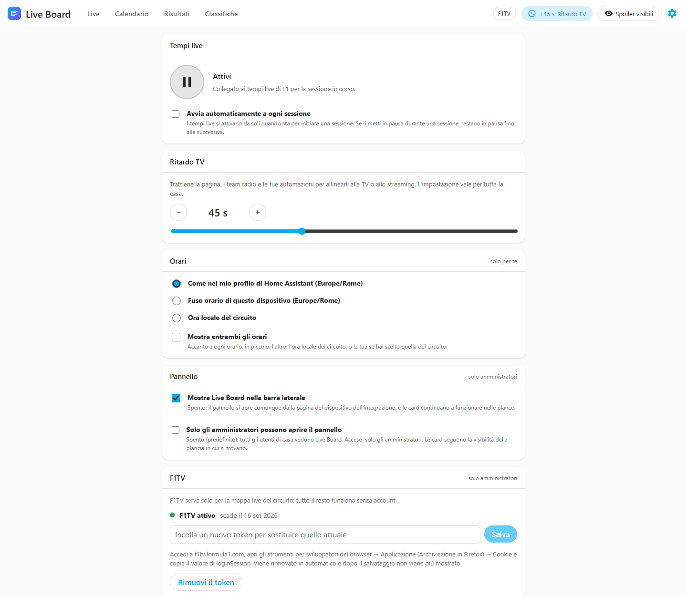

L'ingranaggio in alto a destra nel pannello apre le **Impostazioni**:

- **Tempi live.** Il pulsante grande li accende e li spegne. **In pausa**, niente si
  collega alla F1 e niente di live viene scritto su disco — utile su un Raspberry Pi con
  una scheda SD — e le entità live non sono disponibili. **Attivi**, l'integrazione si
  collega da sola da 30 minuti prima di ogni sessione e si stacca pochi minuti dopo la
  fine; fuori dalle sessioni controlla solo il calendario. Lo stesso interruttore è
  l'entità **Tempi live**.
- **Avvia automaticamente a ogni sessione.** I tempi live si accendono da soli quando si
  apre la finestra di ogni sessione. Se li metti in pausa durante una sessione, restano
  in pausa fino alla successiva.
- **Ritardo TV**, lo stesso controllo dell'orologio in alto (vedi [Ritardo
  TV](#ritardo-tv)).
- **Orari** (ogni utente per sé): in quale fuso mostrare calendario e conti alla
  rovescia — *come nel mio profilo di Home Assistant* (predefinito: il fuso del server,
  o quello del dispositivo se il profilo lo dice), *fuso orario di questo dispositivo*
  o *ora locale del circuito* — e *Mostra entrambi gli orari*, che aggiunge in piccolo
  l'altro ("15:00 al circuito"). Resta legato al tuo utente di Home Assistant, quindi ti
  segue su ogni dispositivo.
- **F1TV** (solo amministratori): stato e scadenza del token, un campo per incollarne
  uno nuovo e *Rimuovi* (vedi [F1TV](#f1tv-e-la-mappa-live)).
- **Entità**: tutte le entità dell'integrazione con il loro stato; cliccane una per la
  sua cronologia e le sue impostazioni.
- **I miei piloti** (amministratori): fino a cinque piloti seguiti dalla casa, scelti tra
  quelli della stagione. Vedi [I miei piloti](#i-miei-piloti).
- **Riepilogo a fine sessione** (amministratori): i servizi di notifica a cui inviarlo e
  dopo quali sessioni. Vedi [Riepilogo della sessione](#riepilogo-della-sessione).
- **Pannello** (solo amministratori): *Mostra Live Board nella barra laterale* e *Solo
  gli amministratori possono aprire il pannello* — spento di serie, così lo vedono tutti
  gli utenti di casa. Vedi [chi vede cosa](#chi-vede-cosa).

Mentre i tempi live sono in pausa, in alto compare l'etichetta tratteggiata **In
pausa**, che apre le Impostazioni. Calendario, risultati e classifiche non ne dipendono.

## Le quattro pagine

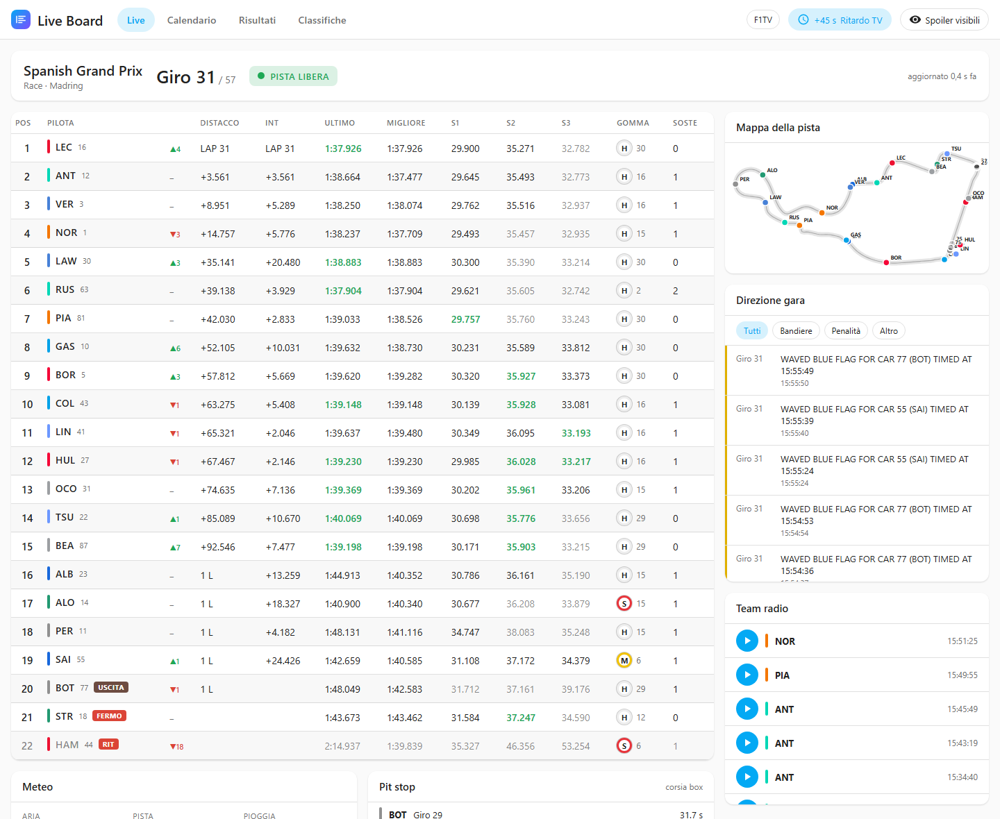

**Live.** Durante una sessione: la striscia della sessione (giro o tempo rimanente, e
quanto sono vecchi i dati), [bandiere e commissari](#bandiere-e-commissari), la
classifica con i tempi, la direzione gara, i team radio, il meteo, i pit stop e — con
F1TV — la mappa della pista.

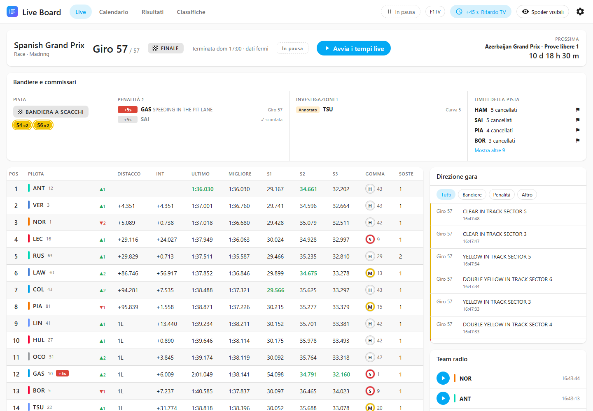

Dopo una sessione la pagina ne conserva lo **stato finale**, fermo: la classifica, le
decisioni dei commissari, la direzione gara, i team radio e i pit stop, con l'etichetta
*FINALE*, l'ora in cui è terminata e, a destra, il conto alla rovescia per la sessione
successiva. Se durante la sessione i tempi live erano in pausa, lo stato finale arriva
dall'archivio della F1 la prima volta che apri la pagina (viene pubblicato circa mezz'ora
dopo la sessione). Prima della prima sessione dell'anno, o se non c'è niente da
mostrare, la pagina mostra la prossima sessione con il conto alla rovescia e, se i
tempi live sono in pausa, un pulsante play.

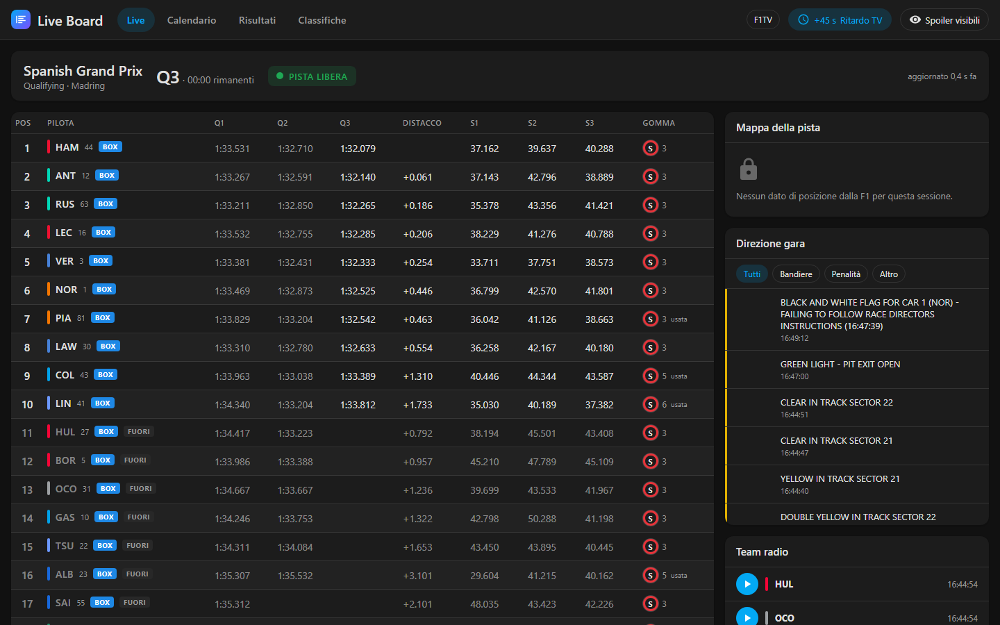

In qualifica la classifica mostra il miglior tempo di ogni pilota in Q1, Q2 e Q3, il
distacco dal più veloce nella parte in corso, e una linea rossa tratteggiata dove
inizia la zona di eliminazione.

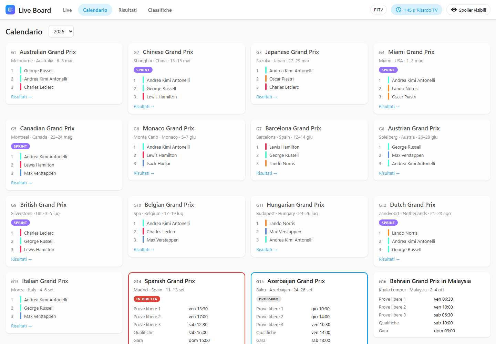

**Calendario.** Ogni weekend della stagione, le sessioni nel fuso orario del tuo Home
Assistant, il conto alla rovescia per la prossima e il podio di ogni weekend già corso.
Scegli qualsiasi stagione dal menu.

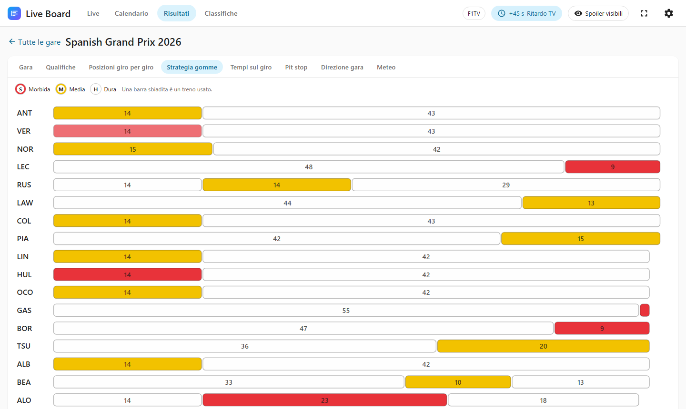

**Risultati.** Qualsiasi stagione dal 1950. Apri una gara per le sue schede; una scheda
compare solo quando i dati esistono:

| Scheda | Da |
|---|---|
| Gara | 1950 |
| Qualifiche | 1994 |
| Sprint | 2021 |
| Posizioni giro per giro | 1996 |
| Pit stop | 2011 |
| Strategia gomme, Tempi sul giro, Direzione gara, Meteo | 2018 |

Le schede dal 2018 arrivano dall'archivio delle sessioni della F1: la prima volta che
apri una gara viene scaricato una volta sola (qualche MB) e resta in cache, così le
aperture successive sono immediate.

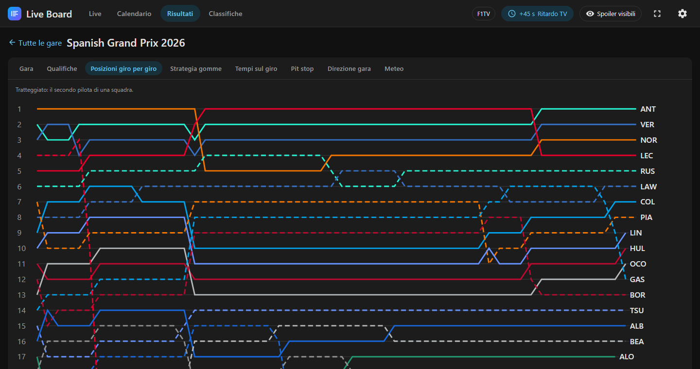

Nel grafico delle posizioni, clicca una linea per evidenziare quel pilota.

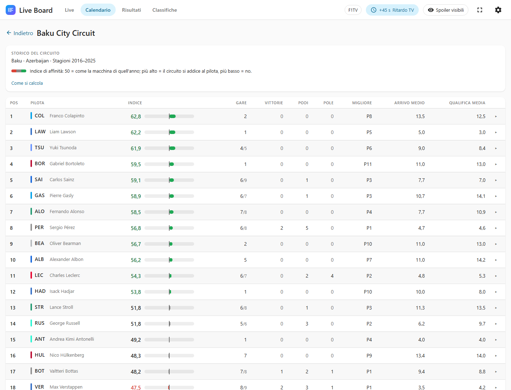

**Storico del circuito.** Da un weekend del Calendario o da una gara nei Risultati,
*Storico del circuito* apre i precedenti di quel circuito per i piloti di questa
stagione: gare corse lì, vittorie, podi, pole, miglior piazzamento, arrivo e qualifica
medi, e un **indice di affinità**. Clicca un pilota per vedere ogni suo anno lì:
squadra, qualifica, griglia (▼ quando una penalità o la partenza dalla pit lane l'ha
messo dietro la sua qualifica), arrivo, punti, esito, giro veloce e le penalità dei
commissari (dal 2018).

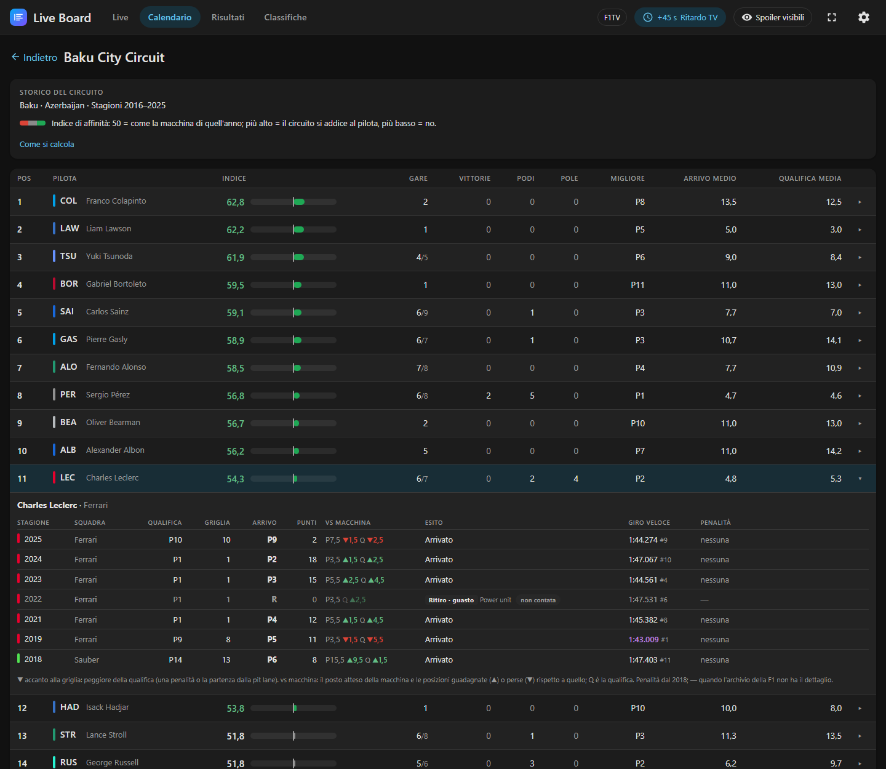

L'**indice di affinità** risponde a "questo circuito gli si addice, macchina a parte?".
Ogni anno, il posto della squadra nel campionato costruttori di quella stagione dice
dove ci si aspettava che arrivassero le sue macchine (costruttori P1 → P1,5, P5 → P9,5);
l'indice guarda di quanti posti il pilota ha fatto meglio o peggio in gara (60%) e in
qualifica (40%). 50 vuol dire "come la macchina"; ogni posto in meglio aggiunge 5. Gli
anni recenti pesano di più (ogni anno indietro conta l'85% del successivo), un ritiro
per guasto non conta, e con una o due gare soltanto l'indice resta vicino a 50: un
pomeriggio fortunato non è un'affinità. Legge un circuito, non il valore di un pilota:
non vede gli ordini di scuderia né un aggiornamento a metà stagione.

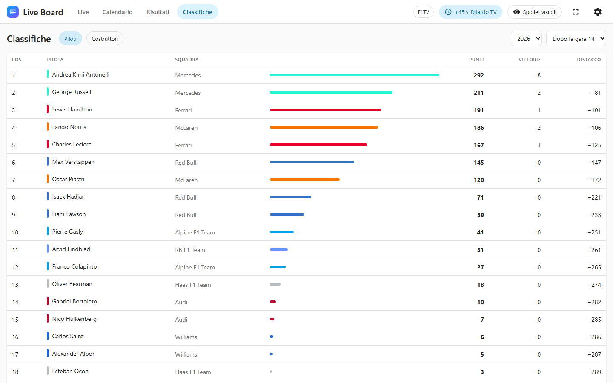

**Classifiche.** Piloti e costruttori, qualsiasi stagione, dopo qualsiasi gara, con
punti, vittorie, distacco dal primo e posizioni guadagnate o perse rispetto alla gara
precedente.

## Leggere la classifica live

| Colonna | Significato |
|---|---|
| Pos | Posizione. ▲/▼ accanto al pilota: posizioni guadagnate o perse dalla partenza (gare e sprint). |
| Distacco | Tempo dal primo. `1 L`: un giro di ritardo. |
| Int | Intervallo: tempo dall'auto immediatamente davanti. |
| Ultimo, Migliore | Ultimo e miglior giro. |
| S1, S2, S3 | I tre settori del giro in corso; i valori in grigio sono del giro appena concluso. |
| Gomma | Mescola (S soft rossa, M medium gialla, H hard bianca, I intermedia verde, W da bagnato blu), poi i **giri su quel treno**. *usata* indica un treno che aveva già giri prima di questo stint. |
| Soste | Pit stop fatti finora. |

I colori seguono la convenzione della F1: **viola** è il più veloce della sessione,
**verde** è il miglior personale del pilota. Etichette: `BOX` in corsia box, `USCITA`
mentre ne esce, `RIT` ritirato, `FERMO` fermo in pista, `FUORI` eliminato in qualifica. Un'auto ritirata
o ferma mostra, al posto del distacco, il giro in cui è successo (`giro 7`).

Un `+5s` rosso dopo il numero di un pilota è una penalità in tempo non ancora scontata.

Clicca una riga per seguire un pilota: la riga, il suo punto sulla mappa e i suoi team
radio vengono evidenziati, e la riga si apre:

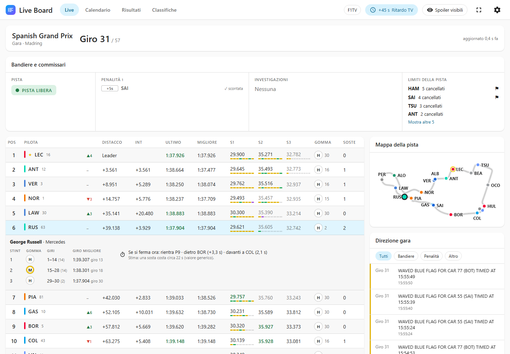


- **Stint:** ogni treno di gomme finora, con la mescola, i giri percorsi e il giro
  migliore — giri 1–24 con le medie, migliore 1:33.1 al giro 18, poi le soft dal giro 25.
- **Se si fermasse ora** (gare e sprint): la posizione in cui rientrerebbe e le auto
  subito davanti e dietro. È una stima: il tempo che una sosta costa di solito su quel
  circuito (22 s dove non è noto), meno con safety car o VSC, confrontato con i distacchi
  delle auto sullo stesso giro.

Sotto ogni tempo di settore una striscia sottile mostra i **mini-settori** del giro in
corso nei colori della F1: viola per il più veloce della sessione, verde per il miglior
personale, giallo altrimenti.

La direzione gara si filtra per bandiere o per penalità.

Quando il flusso tace, un avviso lo dice dopo 30 secondi e la pagina diventa grigia
dopo 60: niente che non sia live viene mai mostrato come live.

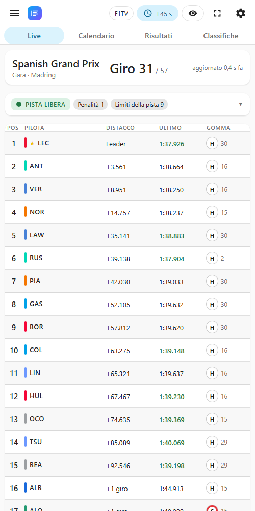

Sul telefono la classifica tiene posizione, pilota, distacco, ultimo giro e gomma.

## Bandiere e commissari

La scheda tra la striscia della sessione e la classifica legge la direzione gara per te:

| Colonna | Cosa mostra |
|---|---|
| Pista | Lo stato della pista, i settori in giallo (`S7`) o doppio giallo (`S10 ×2`) e la fase della safety car o della VSC, compreso *rientra in questo giro*. |
| Penalità | Tutte le penalità della sessione, dalla più recente: `+5s`, `DT` (drive-through), `SG` (stop and go), penalità in griglia, `DSQ`. Una penalità scontata diventa grigia con un ✓. |
| Investigazioni | Incidenti *annotati*, *sotto investigazione* o da esaminare *dopo la gara*, con le auto e la curva. Escono dall'elenco quando i commissari decidono. |
| Limiti della pista | Giri cancellati per pilota, e ⚑ per una bandiera bianconera. |

Quando è tutto tranquillo la scheda è una riga sola; con la safety car o una bandiera
rossa prende un bordo colorato. Sul telefono è una riga di etichette: toccala per aprire
le colonne.

La F1 non ha un flusso strutturato per le penalità: vengono lette dai messaggi dei
commissari. La lettura è stata verificata su quattro gare intere senza errori, ma una
formulazione nuova potrebbe sfuggire; la direzione gara mostra sempre il messaggio
originale.

## Ritardo TV

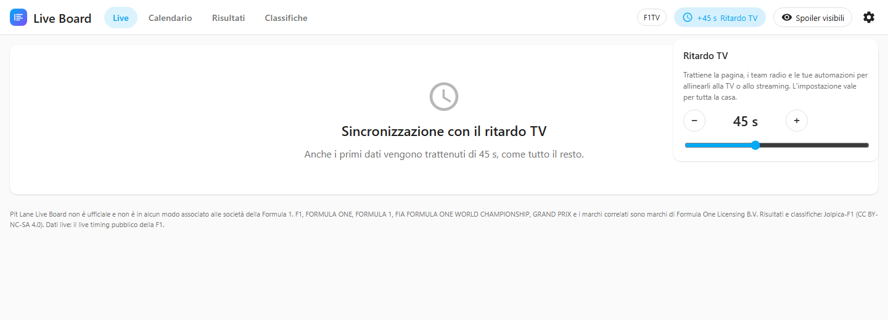

Il live timing arriva prima della TV: qualche secondo prima della diretta, fino a un
minuto o più prima di uno streaming. Clicca l'orologio in alto e imposta un ritardo da 0
a 120 secondi: la pagina, i team radio, le entità e gli eventi per le automazioni
aspettano tutti di quel tanto.

Regolalo durante una sessione: quando un'auto taglia il traguardo in TV, la classifica
dovrebbe cambiare nello stesso istante. L'impostazione è una per tutta la casa, perché
le luci seguono la stessa TV. È anche l'entità numero **Ritardo TV**.

Quando si apre una connessione, anche i primi dati aspettano il ritardo: fino ad
allora la pagina dice "Sincronizzazione con il ritardo TV".

## Modalità senza spoiler

Registri la gara per guardarla dopo cena? Clicca l'occhio in alto (o accendi
l'interruttore **Modalità senza spoiler**). Finché non la spegni:

- la pagina Live mostra solo quale sessione è in corso;
- i risultati del weekend in corso sono nascosti, gara per gara e scheda per scheda,
  ognuno con il pulsante *Mostra questa sessione*;
- il calendario nasconde il podio del weekend;
- le classifiche mostrano la situazione di prima del weekend;
- le entità live non hanno valore e non parte nessun evento della direzione gara.

I dati nascosti non escono mai da Home Assistant: li trattiene l'integrazione, non la
pagina che li copre.

## F1TV e la mappa live

Tutto funziona senza account. Un **abbonamento F1TV** aggiunge una sola cosa: la mappa
live della pista, perché la F1 manda le posizioni delle auto solo agli abbonati. I team
radio non ne hanno bisogno.

Un amministratore aggiunge il token una volta:

1. Dal browser, accedi a F1TV (`f1tv.formula1.com`) con un abbonamento attivo.
2. Apri gli strumenti per sviluppatori del browser (F12) → *Applicazione*
   (*Archiviazione* in Firefox) → *Cookie* → `https://f1tv.formula1.com`.
3. Copia il **valore** del cookie `loginSession`.
4. Nel pannello: **Impostazioni** (l'ingranaggio) → *F1TV*, incollalo e premi *Salva*.
   (Oppure in Home Assistant: *Impostazioni → Dispositivi e servizi → Pit Lane Live
   Board → Configura*.)

Va bene anche il solo token o un'intestazione `Bearer …`. Il token non viene più
mostrato. Si rinnova da solo (ogni pochi giorni); circa una volta al mese la F1 chiude
l'accesso da cui proviene, e un avviso in *Impostazioni → Riparazioni* te ne chiede uno
nuovo — nel frattempo tutto tranne la mappa continua a funzionare. *Rimuovi il token*
nelle Impostazioni (o in *Configura*) lo toglie.

Dove viene conservato: in `.storage/core.config_entries` di Home Assistant, in chiaro,
come il token di ogni altra integrazione. Non viene mai mandato alla pagina, alle
entità, ai registri o alla diagnostica — solo alla F1.

Il circuito è disegnato dalle posizioni delle auto nell'archivio della F1 di una
sessione precedente sulla stessa pista; per un circuito nuovo viene disegnato dal vivo
dopo il primo giro.

## Card per le plance

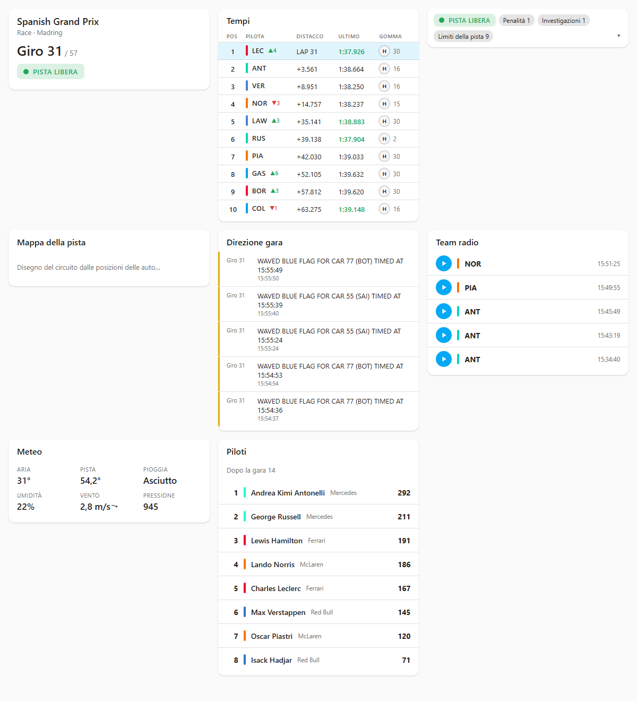

Ogni pezzo della pagina Live è anche una card per le tue plance. Non c'è niente da
installare: dopo aver configurato l'integrazione, *Modifica plancia → Aggiungi card* le
elenca sotto **Pit Lane**, ognuna con il suo editor visuale.

Tra le risorse delle plance (*Impostazioni → Plance → ⋮ → Risorse*) trovi una voce
aggiunta dall'integrazione, `/api/pit_lane_live_board/frontend/loader.js`: è lei che
porta le card anche nell'app Companion. Lasciala dov'è; se la togli si rimette al
riavvio, e sparisce da sola quando rimuovi l'integrazione. Con le risorse in YAML la
voce non finisce nei tuoi file.

| Card | Tipo | Opzioni |
|---|---|---|
| Classifica live | `custom:pit-lane-tower-card` | `rows` (1–22), `columns` (`gap`, `interval`, `last`, `best`, `sectors`, `tyre`, `pits`), `highlight` (sigla o numero di un pilota) |
| Mappa della pista | `custom:pit-lane-map-card` | — (solo dal vivo, richiede F1TV) |
| Bandiere e commissari | `custom:pit-lane-stewards-card` | — |
| Team radio | `custom:pit-lane-radio-card` | `count` |
| Direzione gara | `custom:pit-lane-race-control-card` | `count`, `filter` (`all`, `flags`, `penalties`, `other`) |
| Sessione | `custom:pit-lane-session-card` | — |
| Meteo | `custom:pit-lane-weather-card` | — |
| Campionato | `custom:pit-lane-standings-card` | `kind` (`drivers`, `constructors`), `rows` |

Ogni card accetta anche `title` (lascialo vuoto per non avere titolo).

Le card mostrano le stesse cose della pagina Live: seguono il ritardo TV e la modalità
senza spoiler, dicono quando il flusso è in ritardo o perso, offrono un pulsante play
mentre i tempi live sono in pausa e, dopo una sessione, ne mostrano lo stato finale (la
mappa torna alla sessione successiva). Tutte le card di una pagina condividono un solo
collegamento con Home Assistant.

Una plancia compatta per la gara, in YAML:

```yaml
type: vertical-stack
cards:
  - type: custom:pit-lane-session-card
  - type: custom:pit-lane-stewards-card
  - type: custom:pit-lane-tower-card
    rows: 10
    columns: [gap, last, tyre]
    highlight: LEC
```

### Chi vede cosa

- **Il pannello:** tutti gli utenti di casa, a meno che un amministratore non attivi
  *Solo gli amministratori possono aprire il pannello* nelle Impostazioni (o in
  *Configura*). Ogni utente può anche nasconderlo dalla propria barra laterale
  (*Profilo → Modifica l'ordine e nascondi elementi della barra laterale*).
- **Le card:** chi può vedere la plancia in cui si trovano; lo decide Home Assistant,
  plancia per plancia.
- **Token F1TV e opzioni del pannello:** solo gli amministratori.

"Solo amministratori" nasconde il pannello, non chiude a chiave i dati. Calendario,
risultati e tempi sono informazioni pubbliche della F1, e qualsiasi utente collegato
può comunque leggerli da una card o dalle entità.

## I miei piloti

Segui fino a cinque piloti dalle Impostazioni. Per ognuno:

- un sensore, **Pilota LEC**, con la posizione come stato e, negli attributi, miglior
  giro, gomma, stint, soste, penalità, stato e posizioni guadagnate (distacchi, tempi
  sul giro e giri della gomma cambiano a ogni giro o più spesso: restano nella pagina e
  nelle card, così il registro non viene scritto di continuo);
- una ★ accanto alla sigla nella classifica, e la riga evidenziata nella card della
  classifica se non ha un pilota suo;
- l'evento **I miei piloti**: `position_gained`, `position_lost`, `took_lead`, `pit_in`,
  `pit_out`, `fastest_lap`, `retired`, `penalty`, con `driver` (la sigla), `position`,
  `previous_position` e `lap`. Le posizioni contano solo in gara e sprint.

```yaml
alias: Leclerc in testa
triggers:
  - trigger: state
    entity_id: event.pit_lane_live_board_my_drivers
conditions:
  - "{{ trigger.to_state.attributes.event_type == 'took_lead' }}"
  - "{{ trigger.to_state.attributes.driver == 'LEC' }}"
actions:
  - action: light.turn_on
    target: { entity_id: light.soggiorno }
    data: { color_name: red, flash: long }
```

## Riepilogo della sessione

A fine sessione l'integrazione invia un riepilogo alle destinazioni scelte nelle
Impostazioni, dopo i tipi di sessione che scegli: un telefono con l'app di Home
Assistant, le notifiche di Home Assistant stesso, oppure le entità di notifica create da
integrazioni come il bot Telegram o l'e-mail. Scrivi una parte del nome — `pixel`,
`telegram` — e sceglila tra i suggerimenti (o con le frecce e Invio); ogni destinazione
scelta ha il suo pulsante *Rimuovi*. *Invia una prova* manda il riepilogo di ciò che
mostra la pagina Live.

Si legge come un titolo di giornale: il titolo dice cosa è successo, la prima riga è il
risultato e la seconda i tuoi piloti (★), così il telefono bloccato racconta già tutto.

```text
🏆 Antonelli vince · Spanish GP
🥇 ANT · 🥈 VER +4.351 · 🥉 NOR +5.089
★ LEC P4 ▲1 · HAM ritirato al giro 7
⏱️ Giro veloce: RUS 1:35.587
📈 Rimonta: BEA da P22 a P16
❌ Ritirati: HAM, STR, PER, SAI
⚖️ Penalità: SAI +5s, GAS +5s
```

La qualifica apre con la pole (`⚡ Norris in pole · Spanish GP`, o il distacco quando è
sotto i cinque centesimi), le libere con il più veloce (`⏱️ Libere 2: Piastri il più
veloce`). La *rimonta* è quella del pilota fuori dal podio che ha guadagnato più
posizioni, da tre in su. Un ritiro indica il giro in cui è avvenuto.

*Contenuto* sceglie quanto: **Compatto**, come sopra, oppure **Esteso**, che aggiunge la
classifica completa — medaglie per il podio, `4. ★LEC +29.116 · 1:36.063` (distacco e
giro migliore), `+1 giro`, ⏱️ accanto al giro veloce, i ritirati in fondo con il loro
giro; in qualifica, l'ordine diviso nelle sue parti: Q3 con i distacchi, poi *Fuori in
Q2* e *Fuori in Q1* con il tempo di ciascuno. I `facts` dell'evento contengono sempre la
classifica completa.

Sul telefono con l'app di Home Assistant un tocco sul riepilogo apre la plancia, e ogni
riepilogo sostituisce il precedente invece di accumularsi; su Android ha un canale suo,
*Pit Lane Live Board*, così puoi dargli un suono dedicato nelle impostazioni del
telefono. Anche nelle notifiche di Home Assistant il nuovo riepilogo sostituisce il
vecchio. Lo fai leggere da un'automazione TTS? Ogni emoji apre la sua riga: toglile con
`{{ message | regex_replace('^\\W+', '', multiline=True) }}` se l'altoparlante le legge.

È anche l'evento **Riepilogo della sessione**, con `title` e `message` pronti da inviare
o da far leggere e i dati da cui nascono, per le tue automazioni. Con la modalità senza
spoiler attiva aspetta che tu scopra la sessione o spenga la modalità.

## Schermi dedicati

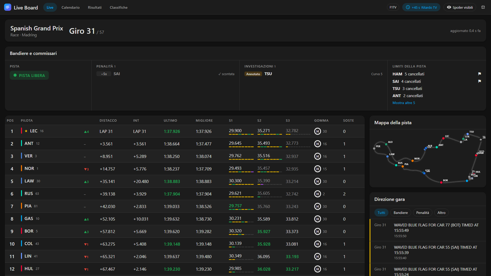

**Una TV, un monitor con un Raspberry Pi, un tablet a parete.** Aggiungi `?kiosk`
all'indirizzo del pannello (le Impostazioni lo mostrano, pronto da copiare): il pannello
riempie tutto lo schermo, sopra la barra laterale e l'intestazione di Home Assistant, e
il puntatore sparisce quando è fermo. Su un Raspberry Pi aprilo con
`chromium --kiosk "http://homeassistant.local:8123/pit-lane-live-board?kiosk"`.
`&page=calendar` apre un'altra pagina, `&scale=1.3` ingrandisce tutto per una TV vista dal
divano. Il pulsante ⛶ in alto fa lo stesso al momento, fino a Esc.

**Uno schermo piccolo: un ESP32 con ESPHome, una cornice e-paper, un anello di LED.**
Attiva il sensore **Schermo piccolo** (è spento di serie: durante una sessione cambia
ogni pochi secondi, cosa che serve solo a uno schermo; se lo attivi puoi anche
escluderlo dal registro). Il suo stato è quello della pagina Live (`live`, `final`,
`paused`…) e gli attributi sono brevi e piatti, pronti da stampare:

| Attributo | Esempio |
|---|---|
| `meeting`, `session`, `kind` | Spanish Grand Prix, Race, race |
| `lap`, `total_laps`, `part`, `remaining` | 31, 57 (oppure Q2 e i secondi rimasti) |
| `track`, `flag_colour` | `safety_car`, `#ff8c00` — per un anello di LED |
| `safety_car`, `red_flag` | true / false |
| `p1` … `p10` | `" 2 ANT   +3.561 M16"`: posizione, sigla, distacco, gomma e giri |
| `mine` | le righe dei tuoi piloti, su una riga |
| `next_meeting`, `next_session`, `next_start` | la prossima sessione, per un conto alla rovescia |

Lo schermo non parla mai con la F1: il ritardo TV e la modalità senza spoiler sono già
applicati. Scrive solo quando ciò che mostra cambia, ma durante una sessione succede
ogni pochi secondi: per tenerlo fuori dalla cronologia di Home Assistant, aggiungi a
`configuration.yaml`:

```yaml
recorder:
  exclude:
    entities:
      - sensor.pit_lane_live_board_small_screen
```

```yaml
# ESPHome: legge da Home Assistant quello che serve allo schermo.
text_sensor:
  - platform: homeassistant
    id: f1_state        # live, final, paused, idle…
    entity_id: sensor.pit_lane_live_board_small_screen
  - platform: homeassistant
    id: f1_track        # clear, yellow, safety_car, red_flag…
    entity_id: sensor.pit_lane_live_board_small_screen
    attribute: track
  - platform: homeassistant
    id: f1_p1           # " 1 LEC          H30"
    entity_id: sensor.pit_lane_live_board_small_screen
    attribute: p1
  - platform: homeassistant
    id: f1_p2
    entity_id: sensor.pit_lane_live_board_small_screen
    attribute: p2
  - platform: homeassistant
    id: f1_mine         # i tuoi piloti, una riga
    entity_id: sensor.pit_lane_live_board_small_screen
    attribute: mine
sensor:
  - platform: homeassistant
    id: f1_lap
    entity_id: sensor.pit_lane_live_board_small_screen
    attribute: lap

display:
  - platform: ...       # il tuo schermo
    lambda: |-
      it.printf(0, 0, id(font_big), "LAP %.0f", id(f1_lap).state);
      it.print(0, 40, id(font_mono), id(f1_p1).state.c_str());
      it.print(0, 60, id(font_mono), id(f1_p2).state.c_str());
      it.print(0, 90, id(font_small), id(f1_mine).state.c_str());
```

## Entità e automazioni

L'integrazione aggiunge un dispositivo, **Pit Lane Live Board**, con queste entità (i
loro id seguono la lingua di Home Assistant al momento dell'installazione; li trovi
nella pagina del dispositivo):

| Entità | Cosa dice |
|---|---|
| Sessioni (calendario) | Ogni sessione della stagione. |
| Prossima sessione | Inizio della prossima sessione; attributi meeting, session, circuit, round. |
| Stato della sessione | `inactive`, `started`, `aborted`, `finished`, `finalised`. |
| Stato della pista | `clear`, `yellow`, `safety_car`, `virtual_safety_car`, `vsc_ending`, `red_flag`, `chequered`. |
| Giro | Giro in corso; attributo `total_laps`. |
| Sessione in corso | Acceso mentre una sessione è in corso. |
| Safety car | Acceso mentre la safety car è in pista; attributo `ending` nel suo ultimo giro. |
| Virtual safety car | Lo stesso per la virtual safety car. |
| Bandiera rossa | Acceso con bandiera rossa. |
| Bandiera gialla | Acceso con una gialla ovunque; attributi `sectors` e `double`. |
| Penalità | Penalità date nella sessione; attributo `penalties` (pilota, tipo, secondi, motivo, giro, scontata). |
| Investigazioni | Incidenti annotati o sotto investigazione; attributo `investigations`. |
| Messaggio della direzione gara | L'ultimo messaggio della direzione gara, in inglese come lo scrive la F1. |
| Direzione gara (evento) | `green_flag`, `yellow_flag`, `safety_car`, `virtual_safety_car`, `vsc_ending`, `red_flag`, `chequered_flag`, `session_started`, `session_ended`. |
| Commissari (evento) | Un evento per ogni decisione dei commissari: `time_penalty`, `drive_through`, `stop_go`, `grid_penalty`, `penalty_served`, `disqualified`, `noted`, `investigation`, `investigation_after_race`, `no_further_action`, `warning`, `black_and_white_flag`, `lap_deleted`; attributi `drivers`, `numbers`, `seconds`, `places`, `reason`, `turn`, `lap`, `message`. |
| Pilota LEC (uno per pilota seguito) | La posizione del pilota; il resto negli attributi. Vedi [I miei piloti](#i-miei-piloti). |
| I miei piloti (evento) | Gli eventi dei piloti seguiti. |
| Riepilogo della sessione (evento) | Il riepilogo a fine sessione. |
| Schermo piccolo (spento di serie) | Per gli schermi piccoli: vedi [Schermi dedicati](#schermi-dedicati). |
| Tempi live | Tempi live attivi (play) o in pausa. |
| Modalità senza spoiler | Interruttore. |
| Ritardo TV | Secondi di ritardo. |
| F1TV | Stato di F1TV (diagnostica). |

Le entità live seguono il ritardo TV, diventano non disponibili quando il flusso si
perde o i tempi live sono in pausa, e tacciono in modalità senza spoiler. Scrivono un
nuovo stato solo quando il valore cambia, quindi una gara aggiunge qualche centinaio di
righe al registro, non migliaia; gli elenchi di penalità e investigazioni restano fuori
dal registro.

Negli esempi qui sotto gli id sono quelli di un'installazione in inglese: sostituiscili
con i tuoi.

**Una notifica 15 minuti prima della gara** — il trigger del calendario pensa ai tempi:

```yaml
alias: Gara tra 15 minuti
triggers:
  - trigger: calendar
    event: start
    offset: "-0:15:0"
    entity_id: calendar.pit_lane_live_board_sessions
conditions:
  - condition: template
    value_template: "{{ trigger.calendar_event.summary.endswith('Gara') }}"
actions:
  - action: notify.mobile_app_mio_telefono
    data:
      message: "{{ trigger.calendar_event.summary }} inizia tra 15 minuti"
```

**Luci che seguono la pista:**

```yaml
alias: Le luci seguono lo stato della pista
triggers:
  - trigger: state
    entity_id: sensor.pit_lane_live_board_track_status
actions:
  - choose:
      - conditions: "{{ trigger.to_state.state in ['yellow', 'safety_car', 'virtual_safety_car', 'vsc_ending'] }}"
        sequence:
          - action: light.turn_on
            target: { entity_id: light.soggiorno }
            data: { color_name: yellow }
      - conditions: "{{ trigger.to_state.state == 'red_flag' }}"
        sequence:
          - action: light.turn_on
            target: { entity_id: light.soggiorno }
            data: { color_name: red }
      - conditions: "{{ trigger.to_state.state == 'clear' }}"
        sequence:
          - action: light.turn_on
            target: { entity_id: light.soggiorno }
            data: { color_name: green }
```

**Qualcosa di speciale per la bandiera rossa**, dall'evento della direzione gara:

```yaml
alias: Bandiera rossa
triggers:
  - trigger: state
    entity_id: event.pit_lane_live_board_race_control
conditions:
  - condition: state
    entity_id: event.pit_lane_live_board_race_control
    attribute: event_type
    state: red_flag
actions:
  - action: notify.mobile_app_mio_telefono
    data:
      message: Bandiera rossa!
```

**Una notifica quando il tuo pilota viene penalizzato**, dall'evento dei commissari:

```yaml
alias: Penalità per Leclerc
triggers:
  - trigger: state
    entity_id: event.pit_lane_live_board_stewards
conditions:
  - "{{ trigger.to_state.attributes.event_type in ['time_penalty', 'drive_through', 'stop_go', 'grid_penalty'] }}"
  - "{{ 'LEC' in trigger.to_state.attributes.drivers }}"
actions:
  - action: notify.mobile_app_mio_telefono
    data:
      message: >-
        {{ trigger.to_state.attributes.drivers | join(', ') }}: penalità
        {{ trigger.to_state.attributes.seconds ~ ' s ' if trigger.to_state.attributes.seconds else '' }}
        ({{ trigger.to_state.attributes.reason | lower }})
```

**Luci arancioni per tutto il periodo di safety car**, dal suo sensore binario:

```yaml
alias: Luci safety car
triggers:
  - trigger: state
    entity_id: binary_sensor.pit_lane_live_board_safety_car
    to: ["on", "off"]
actions:
  - action: light.turn_on
    target: { entity_id: light.soggiorno }
    data:
      color_name: "{{ 'orange' if trigger.to_state.state == 'on' else 'white' }}"
```

**Tempi live solo per la gara**, se preferisci tenerli in pausa il resto del weekend:

```yaml
alias: Tempi live per la gara
triggers:
  - trigger: calendar
    event: start
    offset: "-0:30:0"
    entity_id: calendar.pit_lane_live_board_sessions
conditions:
  - "{{ trigger.calendar_event.summary.endswith('Gara') }}"
actions:
  - action: switch.turn_on
    target: { entity_id: switch.pit_lane_live_board_live_timing }
```

## Risoluzione dei problemi

**La pagina Live dice "I tempi live sono in pausa".** Premi play nella pagina o nelle
Impostazioni, oppure attiva *Avvia automaticamente a ogni sessione*.

**La pagina Live dice "Nessuna sessione in corso" durante una sessione.** La
connessione si apre 30 minuti prima dell'orario previsto: controlla l'orario nella
pagina Calendario. Se una sessione è in corso e la pagina aspetta ancora dopo un paio
di minuti, guarda *Impostazioni → Riparazioni* e la diagnostica dell'integrazione
(*Dispositivi e servizi → Pit Lane Live Board → ⋮ → Scarica diagnostica*):
`live.last_error` dice cosa non va.

**"Tempi live non raggiungibili" in Riparazioni.** Tre finestre di sessione di fila si
sono chiuse senza connessione. O questo Home Assistant non raggiunge
`livetiming.formula1.com`, o la F1 ha cambiato il flusso. Calendario, risultati e
classifiche continuano a funzionare; guarda le issue del progetto per le novità.

**"F1TV ha bisogno di un nuovo token" in Riparazioni.** L'accesso mensile alla F1 è
scaduto o la F1 ha rifiutato il rinnovo: incolla un nuovo token (vedi
[F1TV](#f1tv-e-la-mappa-live)).

**Niente mappa.** Serve F1TV, e la F1 deve mandare le posizioni per quella sessione;
la scheda dice quale delle due manca.

**Una scheda dice che l'archivio della F1 non ha il dettaglio.** Alcune sessioni
mancano semplicemente dall'archivio della F1, e prima del 2018 non c'è niente.

**"La fonte dei dati non ha risposto."** Jolpica (risultati, classifiche, calendario)
potrebbe essere occupata; l'integrazione si limita anche da sola a 200 richieste
all'ora. Riprova tra un minuto: quello che era già stato caricato arriva dalla cache.

**L'elenco dei team radio è vuoto.** La F1 pubblica una selezione dei messaggi, e per
alcune sessioni nessuno.

**Nell'app Companion una card dice «Errore di configurazione».** Dalla 0.9.2 non
dovrebbe più succedere: l'app partiva da una copia vecchia della pagina, conservata dal
service worker di Home Assistant, in cui le card non c'erano; ora arrivano anche come
risorsa delle plance, che l'app riceve sempre aggiornata. Se succede ancora dopo aver
chiuso e riaperto l'app due volte, svuota la cache della pagina dalle impostazioni
dell'app: su Android *Impostazioni → App Companion → Risoluzione dei problemi → Reset
frontend cache* (lo "Svuota cache" di Android non basta); su iPhone *Impostazioni → App
Companion → Debug → Reimposta la cache del frontend* (in alcune versioni *Clear web view
cache*).

## Domande frequenti

**È ufficiale?** No. Legge il live timing pubblico e l'archivio della F1 come farebbe
un singolo spettatore, e il database dei risultati di Jolpica-F1, per uso personale e
non commerciale. Entrambi possono cambiare o fermarsi senza preavviso.

**Costa qualcosa?** No. F1TV è facoltativo e serve solo per la mappa live.

**È davvero in diretta?** Quanto il sito dei tempi della F1. Usa il ritardo TV per
allinearti al tuo schermo.

**Quanti dati consuma?** Una sessione live qualche kilobyte al secondo. Aprire il
dettaglio di una gara dal 2018 scarica qualche megabyte una volta sola. Tutto il resto
è piccolo e in cache.

**Funziona su un Raspberry Pi?** Sì: nessuna libreria pesante; fuori dalle finestre di
sessione controlla solo il calendario, e mentre i tempi live sono in pausa non scrive
niente di live sulla scheda SD. Durante una sessione la pagina riceve solo ciò che
cambia.

**Perché niente foto dei piloti o loghi delle squadre?** Appartengono alla F1 e alle
squadre. I piloti sono indicati con la sigla di tre lettere, il numero, il nome e il
colore della squadra.

**Posso rivedere una vecchia gara giro per giro, come se fosse live?** No: lo storico
mostra i risultati e il dettaglio di ogni giro, non un replay.
