# Pit Lane Live Board — guide

*[Italiano](guide.it.md)*

Formula 1 in your Home Assistant sidebar: the live timing tower, the calendar, every
race since 1950 and both championships. This guide covers everything, in order: read
the first two sections and you are set; come back to the others when you need them.

- [Install](#install)
- [Settings and live timing](#settings-and-live-timing)
- [The four pages](#the-four-pages)
- [Reading the timing tower](#reading-the-timing-tower)
- [Flags and stewards](#flags-and-stewards)
- [TV delay](#tv-delay)
- [No-spoiler mode](#no-spoiler-mode)
- [F1TV and the live map](#f1tv-and-the-live-map)
- [Dashboard cards](#dashboard-cards)
- [Entities and automations](#entities-and-automations)
- [Troubleshooting](#troubleshooting)
- [FAQ](#faq)

> Pit Lane Live Board is unofficial and is not associated in any way with the
> Formula 1 companies. F1, FORMULA ONE, FORMULA 1, FIA FORMULA ONE WORLD CHAMPIONSHIP,
> GRAND PRIX and related marks are trade marks of Formula One Licensing B.V.

## Install

You need Home Assistant 2026.6 or later and HACS. No account anywhere: calendar,
results, standings and live timing are free. An F1TV subscription is optional and
only adds the live track map.

1. In HACS, open the menu (⋮) → *Custom repositories*, add
   `https://github.com/foyer-labs/Pit-Lane-Live-Board` with category *Integration*.
2. Find **Pit Lane Live Board** in HACS, download it, and restart Home Assistant.
3. *Settings → Devices & services → Add integration → Pit Lane Live Board.* There is
   nothing to fill in: read the notice and confirm.
4. **Live Board** appears in the sidebar, for every user of the house.
5. Open the panel's **Settings** (the gear at the top right) and press **play**, or turn
   on *Start automatically at each session*. Live timing starts paused: see the next
   section.

To remove it: delete the integration under *Devices & services*, then remove it from
HACS. Its cache (under `.cache/pit_lane_live_board` in your configuration folder) can
be deleted at any time; it is not part of backups.

## Settings and live timing

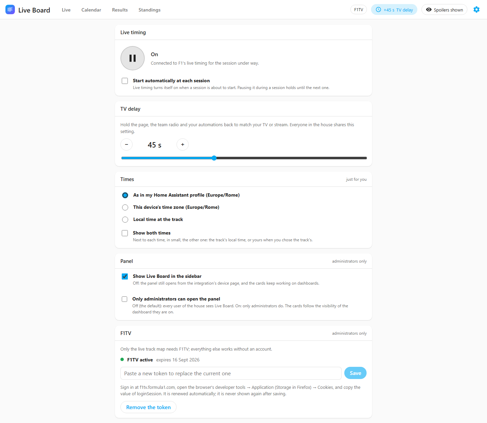

The gear at the top right of the panel opens **Settings**:

- **Live timing.** The big button turns it on and off. **Paused**, nothing connects to
  F1 and nothing live is written to disk — worth it on a Raspberry Pi with an SD card —
  and the live entities are unavailable. **On**, the integration connects by itself
  from 30 minutes before each session and lets go a few minutes after it ends; outside
  sessions it only checks the calendar. The same switch is the **Live timing** entity.
- **Start automatically at each session.** Live timing turns itself on as each session
  window opens. If you pause it during a session, it stays paused until the next one.
- **TV delay**, the same control as the clock in the header (see [TV delay](#tv-delay)).
- **Times** (each user for themselves): which clock the calendar and the countdowns
  use — *as in my Home Assistant profile* (the default: the server's time zone, or your
  device's if your profile says so), *this device's time zone*, or *local time at the
  track* — and *Show both times*, which adds the other clock in small ("15:00 at the
  track"). Kept with your Home Assistant user, so it follows you to every device.
- **F1TV** (administrators only): the token's status and expiry, a field to paste a new
  one, and *Remove* (see [F1TV](#f1tv-and-the-live-map)).
- **Entities**: every entity of the integration with its state; click one for its
  history and settings.
- **Panel** (administrators only): *Show Live Board in the sidebar*, and *Only
  administrators can open the panel* — off by default, so every user of the house
  sees it. See [who sees what](#who-sees-what).

While live timing is paused the header shows a dashed **Paused** chip; it opens
Settings. Calendar, results and standings do not depend on it.

## The four pages

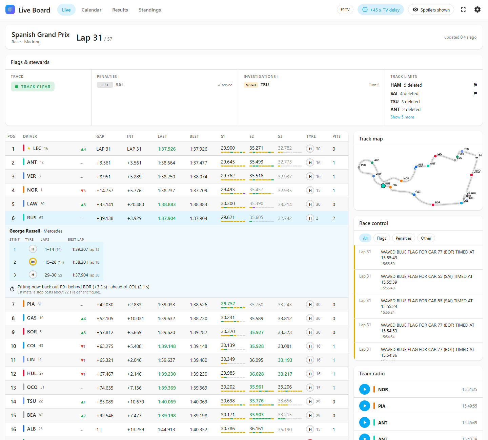

**Live.** During a session: the session strip (lap or clock, and how old the data is),
[flags and stewards](#flags-and-stewards), the timing tower, race control, team radio,
weather, pit stops and — with F1TV — the track map.

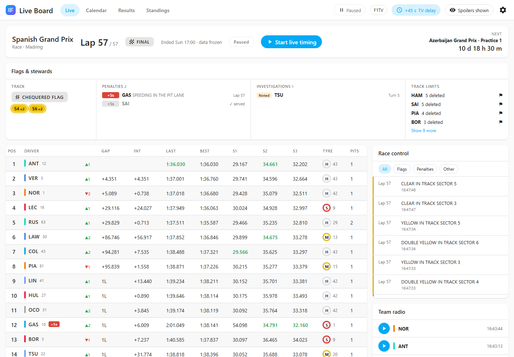

After a session the page keeps its **final state**, frozen: the classification, the
stewards' decisions, race control, radio and pit stops, marked *FINAL* with the time it
ended, and the next session counting down on the right. If live timing was paused
during the session, the final state comes from F1's archive the first time you open the
page (it is published about half an hour after the session). Before the first session
of the year, or with nothing to show, the page shows the next session with a
countdown, and a play button when live timing is paused.

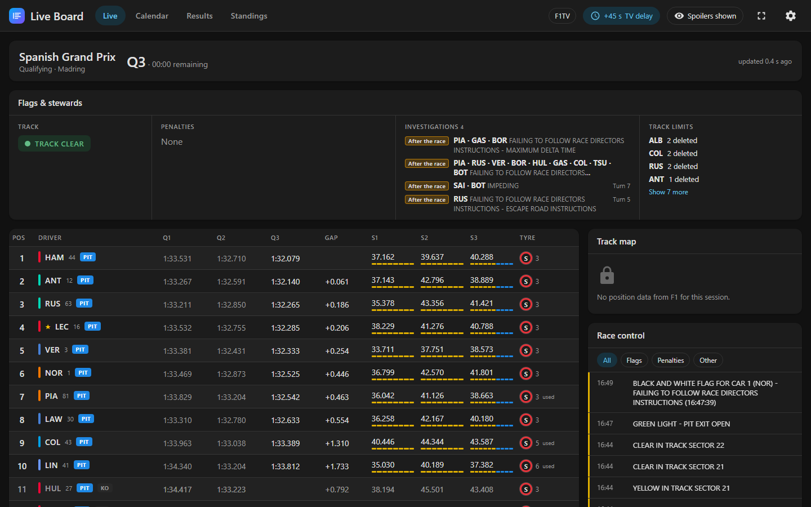

In qualifying the tower shows each driver's best time in Q1, Q2 and Q3, the gap to the
fastest in the current part, and a dashed red line where the knockout zone starts.

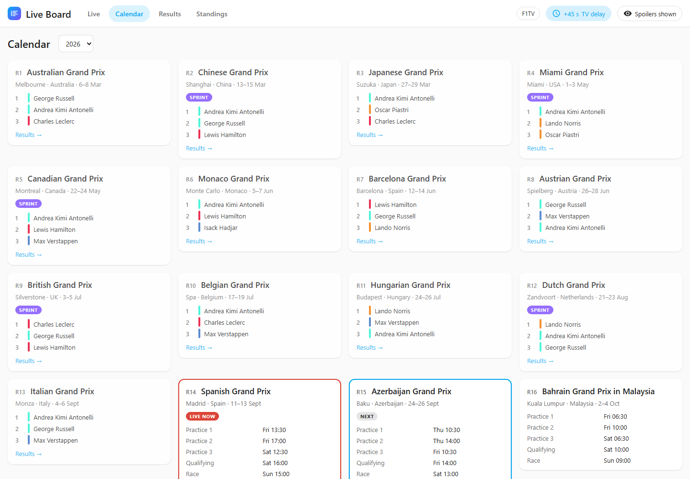

**Calendar.** Every weekend of the season, sessions in your Home Assistant's
timezone, the next session counting down, and the podium of every weekend already run.
Pick any season from the menu.

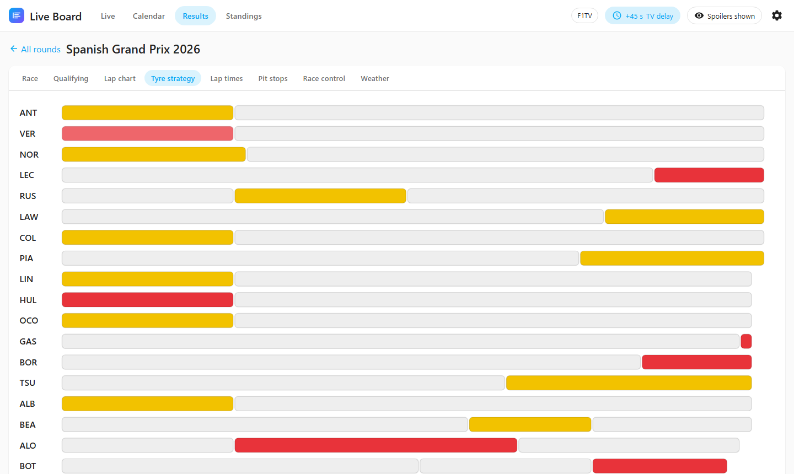

**Results.** Any season since 1950. Open a round for its tabs; a tab appears only when
the data exists:

| Tab | From |
|---|---|
| Race | 1950 |
| Qualifying | 1994 |
| Sprint | 2021 |
| Lap chart | 1996 |
| Pit stops | 2011 |
| Tyre strategy, Lap times, Race control, Weather | 2018 |

The 2018+ tabs come from F1's session archive: the first time you open a race, it is
downloaded once (a few MB) and kept in the cache, so later openings are instant.

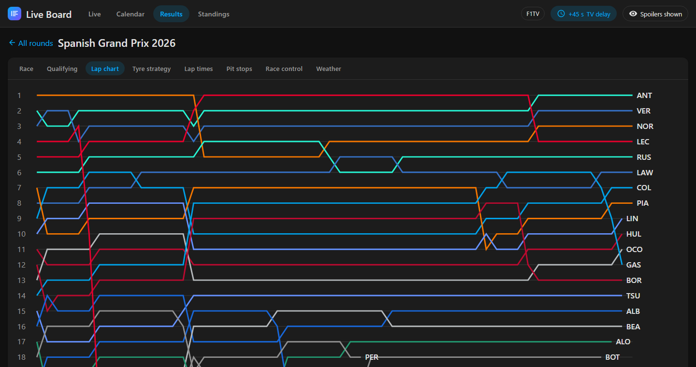

In the lap chart, click a line to highlight that driver.

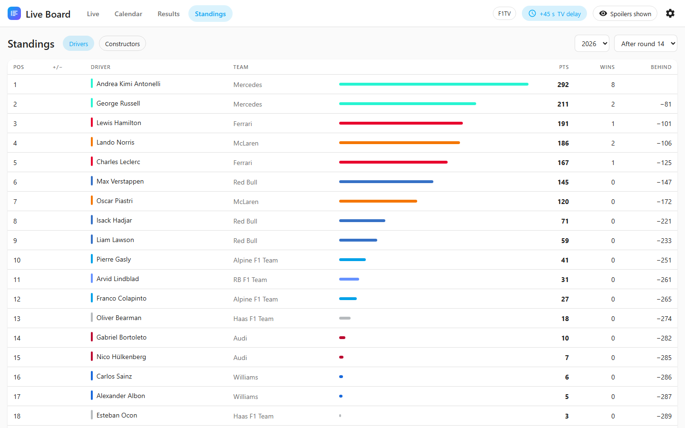

**Standings.** Drivers and constructors, any season, after any round, with points,
wins, the gap to the leader and places gained or lost since the round before.

## Reading the timing tower

| Column | Meaning |
|---|---|
| Pos | Position. ▲/▼ next to the driver: places gained or lost since the start (races and sprints). |
| Gap | Time to the leader. `1 L`: one lap behind. |
| Int | Interval: time to the car directly ahead. |
| Last, Best | Last and best lap. |
| S1, S2, S3 | The three sectors of the current lap; greyed values are from the lap just finished. |
| Tyre | Compound (S soft red, M medium yellow, H hard white, I intermediate green, W wet blue), then the **laps on that set**. *used* marks a set that had laps before this stint. |
| Pits | Pit stops so far. |

Colours follow F1's convention: **purple** is the fastest of the session, **green** is
the driver's personal best. Badges: `PIT` in the pit lane, `OUT` leaving it, `RET`
retired, `STOP` stopped on track, `KO` knocked out of qualifying.

A red `+5s` after a driver's number is a time penalty not served yet.

Click a row to follow a driver: the row, their dot on the map and their team radio are
highlighted. Race control can be filtered to flags or to penalties.

When the feed goes quiet, a banner says so after 30 seconds and the page greys out
after 60: nothing that is not live is ever shown as live.

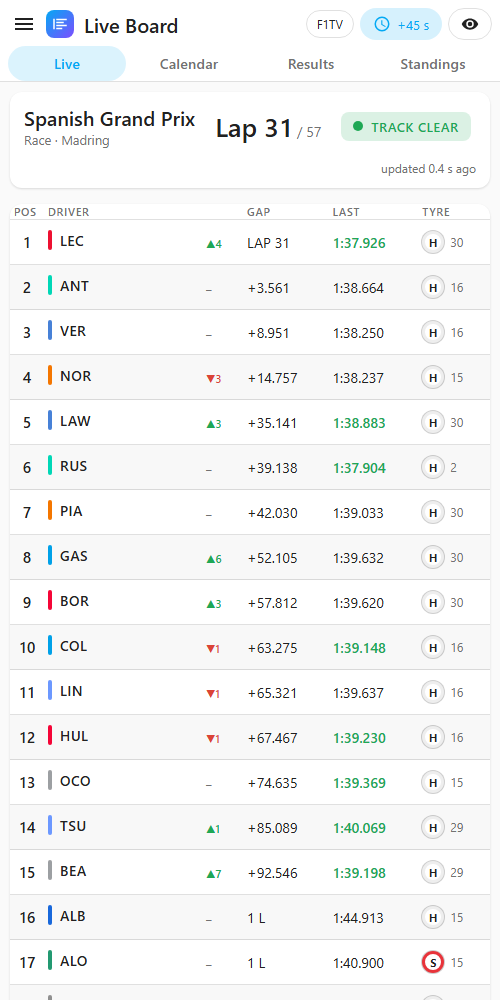

On a phone the tower keeps position, driver, gap, last lap and tyre.

## Flags and stewards

The card between the session strip and the tower reads race control for you:

| Column | What it shows |
|---|---|
| Track | The track status, the sectors under yellow (`S7`) or double yellow (`S10 ×2`), and the safety car or VSC phase, including *in this lap*. |
| Penalties | Every penalty of the session, newest first: `+5s`, `DT` (drive-through), `SG` (stop and go), grid penalties, `DSQ`. A served penalty turns grey with a ✓. |
| Investigations | Incidents *noted*, *under investigation* or to be looked at *after the race*, with the cars and the turn. They leave the list when the stewards decide. |
| Track limits | Laps deleted per driver, and ⚑ for a black and white flag. |

When all is calm the card is a single line; under the safety car or a red flag it gets a
coloured edge. On a phone it is one row of chips: tap it to open the columns.

F1 has no structured feed for penalties: they are read from the stewards' messages.
The reading was checked on four whole races without a miss, but a new wording could
slip through; race control always shows the original message.

## TV delay

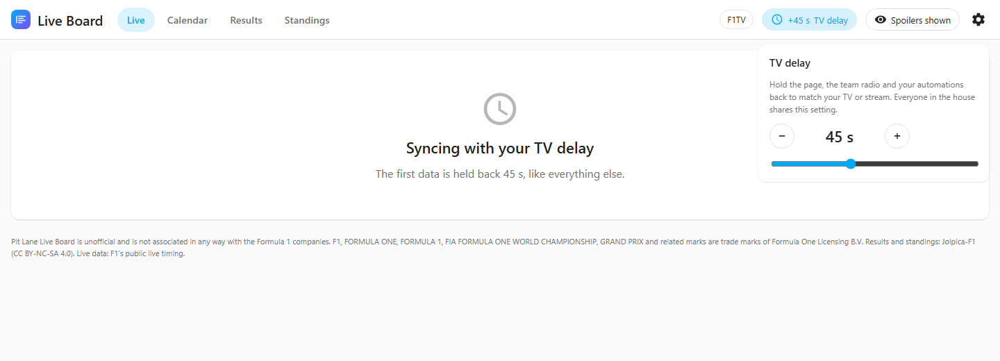

Live timing arrives before your TV — seconds ahead of broadcast, up to a minute or more
ahead of a stream. Click the clock in the header and set a delay of 0–120 seconds: the
page, the team radio, the entities and the automation events all wait by that amount.

Tune it during a session: when a car crosses the line on your TV, the tower should
change at the same moment. The setting is one for the whole house, because the lights
follow the same TV. It is also the **TV delay** number entity.

After a connection opens, even the first data waits for the delay: the page says
"Syncing with your TV delay" until then.

## No-spoiler mode

Recording the race to watch after dinner? Click the eye in the header (or turn on the
**No-spoiler mode** switch). Until you turn it off:

- the Live page shows only which session is running;
- the results of the current weekend are hidden, round by round and tab by tab, each
  with a *Reveal this session* button;
- the calendar hides the weekend's podium;
- standings show the table from before the weekend;
- the live entities have no value and no race-control event fires.

Hidden data never leaves Home Assistant: it is withheld by the integration, not
covered by the page.

## F1TV and the live map

Everything works without an account. An **F1TV subscription** adds one thing: the
live track map, because F1 only sends car positions to subscribers. Team radio does
not need it.

An administrator adds the token once:

1. In a browser, sign in to F1TV (`f1tv.formula1.com`) with an active subscription.
2. Open the browser's developer tools (F12) → *Application* (*Storage* in Firefox) →
   *Cookies* → `https://f1tv.formula1.com`.
3. Copy the **value** of the cookie named `loginSession`.
4. In the panel: **Settings** (the gear) → *F1TV*, paste it and press *Save*. (Or in
   Home Assistant: *Settings → Devices & services → Pit Lane Live Board → Configure*.)

You can also paste the bare token or a `Bearer …` header. The token is never shown
again. It is renewed automatically (every few days); about once a month F1 ends the
login behind it, and a notice in *Settings → Repairs* asks you to paste a new one —
until then everything except the map keeps working. *Remove the token* in Settings (or
*Configure*) removes it.

Where it is kept: in Home Assistant's `.storage/core.config_entries`, in plain text,
like every other integration's token. It is never sent to the page, entities, logs or
diagnostics — only to F1.

The circuit is drawn from the cars' positions in F1's archive of an earlier session at
the same track; for a brand-new circuit it is drawn live after the first lap.

## Dashboard cards

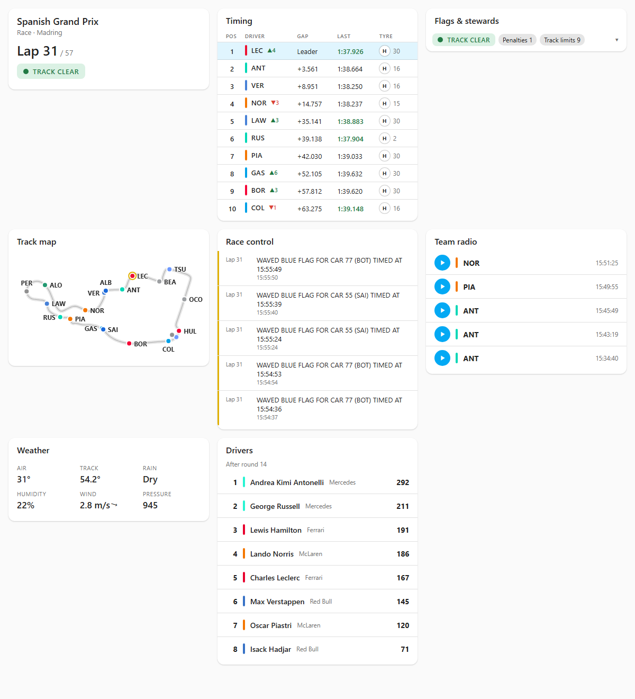

Every piece of the Live page is also a card for your own dashboards. There is nothing
to install: after the integration is set up, *Edit dashboard → Add card* lists them
under **Pit Lane**, each with a visual editor.

| Card | Type | Options |
|---|---|---|
| Timing tower | `custom:pit-lane-tower-card` | `rows` (1–22), `columns` (`gap`, `interval`, `last`, `best`, `sectors`, `tyre`, `pits`), `highlight` (a driver's code or number) |
| Track map | `custom:pit-lane-map-card` | — (live only, needs F1TV) |
| Flags & stewards | `custom:pit-lane-stewards-card` | — |
| Team radio | `custom:pit-lane-radio-card` | `count` |
| Race control | `custom:pit-lane-race-control-card` | `count`, `filter` (`all`, `flags`, `penalties`, `other`) |
| Session | `custom:pit-lane-session-card` | — |
| Weather | `custom:pit-lane-weather-card` | — |
| Championship | `custom:pit-lane-standings-card` | `kind` (`drivers`, `constructors`), `rows` |

Every card also takes `title` (leave it empty for none).

The cards show the same thing as the Live page: they follow the TV delay and
no-spoiler mode, say when the feed is late or lost, offer a play button while live
timing is paused, and after a session show its final state (the map comes back at the
next session). All the cards on a page share one connection to Home Assistant.

A compact race dashboard, in YAML:

```yaml
type: vertical-stack
cards:
  - type: custom:pit-lane-session-card
  - type: custom:pit-lane-stewards-card
  - type: custom:pit-lane-tower-card
    rows: 10
    columns: [gap, last, tyre]
    highlight: LEC
```

### Who sees what

- **The panel:** every user of the house, unless an administrator turns on *Only
  administrators can open the panel* in Settings (or under *Configure*). Each user can
  also hide it from their own sidebar (*Profile → Change the order and hide items from
  the sidebar*).
- **The cards:** whoever can see the dashboard they are on; Home Assistant decides
  that, per dashboard.
- **F1TV token and panel options:** administrators only.

"Only administrators" hides the panel; it is not a lock on the data. Calendar,
results and timing are public F1 information, and any signed-in user can still read
them through a card or the entities.

## Entities and automations

The integration adds one device, **Pit Lane Live Board**, with these entities (their
ids follow Home Assistant's language when you install; find them on the device page):

| Entity | What it says |
|---|---|
| `calendar.pit_lane_live_board_sessions` | Every session of the season. |
| `sensor.pit_lane_live_board_next_session` | Start of the next session; attributes meeting, session, circuit, round. |
| `sensor.pit_lane_live_board_session_status` | `inactive`, `started`, `aborted`, `finished`, `finalised`. |
| `sensor.pit_lane_live_board_track_status` | `clear`, `yellow`, `safety_car`, `virtual_safety_car`, `vsc_ending`, `red_flag`, `chequered`. |
| `sensor.pit_lane_live_board_lap` | Current lap; attribute `total_laps`. |
| `binary_sensor.pit_lane_live_board_session_running` | On while a session runs. |
| `binary_sensor.pit_lane_live_board_safety_car` | On while the safety car is out; attribute `ending` in its last lap. |
| `binary_sensor.pit_lane_live_board_virtual_safety_car` | The same for the virtual safety car. |
| `binary_sensor.pit_lane_live_board_red_flag` | On under a red flag. |
| `binary_sensor.pit_lane_live_board_yellow_flag` | On with a yellow anywhere; attributes `sectors` and `double`. |
| `sensor.pit_lane_live_board_penalties` | Penalties given this session; attribute `penalties` (driver, kind, seconds, reason, lap, served). |
| `sensor.pit_lane_live_board_investigations` | Incidents noted or under investigation; attribute `investigations`. |
| `sensor.pit_lane_live_board_race_control_message` | The latest race control message, in English as F1 writes it. |
| `event.pit_lane_live_board_race_control` | `green_flag`, `yellow_flag`, `safety_car`, `virtual_safety_car`, `vsc_ending`, `red_flag`, `chequered_flag`, `session_started`, `session_ended`. |
| `event.pit_lane_live_board_stewards` | One event per stewards' decision: `time_penalty`, `drive_through`, `stop_go`, `grid_penalty`, `penalty_served`, `disqualified`, `noted`, `investigation`, `investigation_after_race`, `no_further_action`, `warning`, `black_and_white_flag`, `lap_deleted`; attributes `drivers`, `numbers`, `seconds`, `places`, `reason`, `turn`, `lap`, `message`. |
| `switch.pit_lane_live_board_live_timing` | Live timing on (play) or paused. |
| `switch.pit_lane_live_board_no_spoiler_mode` | No-spoiler mode. |
| `number.pit_lane_live_board_tv_delay` | TV delay in seconds. |
| `sensor.pit_lane_live_board_f1tv` | F1TV status (diagnostic). |

Live entities follow the TV delay, become unavailable when the feed is lost or live
timing is paused, and stay quiet in no-spoiler mode. They write a new state only when
their value changes, so a race adds a few hundred rows to the recorder, not thousands;
the penalty and investigation lists are kept out of the recorder.

**A notification 15 minutes before the race** — the calendar trigger does the timing:

```yaml
alias: Race in 15 minutes
triggers:
  - trigger: calendar
    event: start
    offset: "-0:15:0"
    entity_id: calendar.pit_lane_live_board_sessions
conditions:
  - condition: template
    value_template: "{{ trigger.calendar_event.summary.endswith('Race') }}"
actions:
  - action: notify.mobile_app_my_phone
    data:
      message: "{{ trigger.calendar_event.summary }} starts in 15 minutes"
```

**Lights that follow the track:**

```yaml
alias: Lights follow the track status
triggers:
  - trigger: state
    entity_id: sensor.pit_lane_live_board_track_status
actions:
  - choose:
      - conditions: "{{ trigger.to_state.state in ['yellow', 'safety_car', 'virtual_safety_car', 'vsc_ending'] }}"
        sequence:
          - action: light.turn_on
            target: { entity_id: light.living_room }
            data: { color_name: yellow }
      - conditions: "{{ trigger.to_state.state == 'red_flag' }}"
        sequence:
          - action: light.turn_on
            target: { entity_id: light.living_room }
            data: { color_name: red }
      - conditions: "{{ trigger.to_state.state == 'clear' }}"
        sequence:
          - action: light.turn_on
            target: { entity_id: light.living_room }
            data: { color_name: green }
```

**Something special for a red flag**, from the race-control event:

```yaml
alias: Red flag
triggers:
  - trigger: state
    entity_id: event.pit_lane_live_board_race_control
conditions:
  - condition: state
    entity_id: event.pit_lane_live_board_race_control
    attribute: event_type
    state: red_flag
actions:
  - action: notify.mobile_app_my_phone
    data:
      message: Red flag!
```

**A notification when your driver gets a penalty**, from the stewards event:

```yaml
alias: Penalty for Leclerc
triggers:
  - trigger: state
    entity_id: event.pit_lane_live_board_stewards
conditions:
  - "{{ trigger.to_state.attributes.event_type in ['time_penalty', 'drive_through', 'stop_go', 'grid_penalty'] }}"
  - "{{ 'LEC' in trigger.to_state.attributes.drivers }}"
actions:
  - action: notify.mobile_app_my_phone
    data:
      message: >-
        {{ trigger.to_state.attributes.drivers | join(', ') }}:
        {{ trigger.to_state.attributes.seconds ~ ' s ' if trigger.to_state.attributes.seconds else '' }}penalty
        for {{ trigger.to_state.attributes.reason | lower }}
```

**Amber lights for the whole safety car period**, from its binary sensor:

```yaml
alias: Safety car lights
triggers:
  - trigger: state
    entity_id: binary_sensor.pit_lane_live_board_safety_car
    to: ["on", "off"]
actions:
  - action: light.turn_on
    target: { entity_id: light.living_room }
    data:
      color_name: "{{ 'orange' if trigger.to_state.state == 'on' else 'white' }}"
```

**Live timing on for the race only**, if you prefer it paused the rest of the weekend:

```yaml
alias: Live timing for the race
triggers:
  - trigger: calendar
    event: start
    offset: "-0:30:0"
    entity_id: calendar.pit_lane_live_board_sessions
conditions:
  - "{{ trigger.calendar_event.summary.endswith('Race') }}"
actions:
  - action: switch.turn_on
    target: { entity_id: switch.pit_lane_live_board_live_timing }
```

## Troubleshooting

**The Live page says "Live timing is paused".** Press play on the page or in Settings,
or turn on *Start automatically at each session*.

**The Live page says "No session running" during a session.** The connection opens 30
minutes before the scheduled start; check the time on the Calendar page. If a session
is running and the page still waits after a couple of minutes, look at *Settings →
Repairs* and at the integration's diagnostics (*Devices & services → Pit Lane Live
Board → ⋮ → Download diagnostics*): `live.last_error` says what went wrong.

**"Live timing unreachable" in Repairs.** Three session windows in a row ended
without a connection. Either this Home Assistant cannot reach
`livetiming.formula1.com`, or F1 changed its feed. Calendar, results and standings keep
working; check the project's issues for news.

**"F1TV needs a new token" in Repairs.** The monthly F1 login ended or F1 refused the
renewal: paste a new token (see [F1TV](#f1tv-and-the-live-map)).

**No map.** It needs F1TV, and F1 must send positions for that session; the card says
which of the two is missing.

**A tab says F1's archive has no detail.** Some sessions are simply missing from F1's
archive, and nothing before 2018 is there.

**"The data source did not answer."** Jolpica (results, standings, calendar) may be
busy; the integration also limits itself to 200 requests an hour. Try again in a
minute: what was loaded before is served from the cache.

**Team radio list is empty.** F1 publishes a selection of clips, and for some sessions
none at all.

## FAQ

**Is it official?** No. It reads F1's public live timing and archive the way a single
viewer would, and Jolpica-F1's results database, for personal, non-commercial use.
Both can change or stop without notice.

**Does it cost anything?** No. F1TV is optional and only needed for the live map.

**Is it really live?** As live as F1's own timing site. Use the TV delay to match
your screen.

**How much data does it use?** A live session is a few kilobytes a second. Opening a
2018+ race's detail downloads a few megabytes once. Everything else is small and
cached.

**Will it run on a Raspberry Pi?** Yes: no heavy libraries; outside session windows it
only checks the calendar, and while live timing is paused it writes nothing live to
the SD card. During a session the page receives only what changed.

**Why no driver photos or team logos?** They belong to F1 and to the teams. Drivers are
shown by their three-letter code, number, name and team colour.

**Can I watch an old race lap by lap, as if live?** No: history shows results and the
detail of each lap, not a replay.
